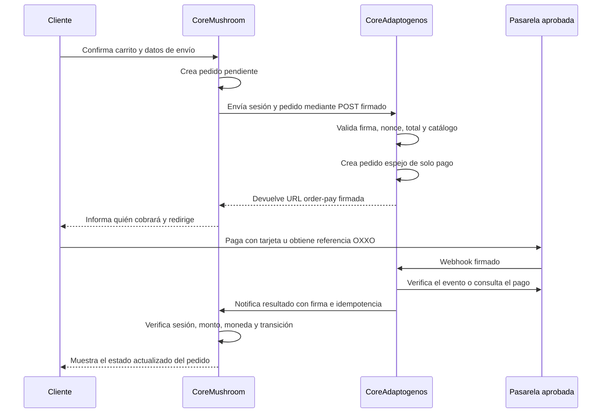

# Metodología de pagos entre CoreMushroom y CoreAdaptogenos

Estado: el puente de tarjeta está implementado en ambos repositorios y falla
cerrado. CoreMushroom contiene la pasarela emisora y el callback firmado;
CoreAdaptogenos contiene el plugin receptor que crea un pedido WooCommerce
espejo y entrega su URL nativa `order-pay`. El plugin receptor está instalado y
activo en el WordPress definitivo, y el secreto compartido ya está guardado en
ambos paneles. El dominio final funciona por HTTPS. Stripe está conectado en
pruebas y en vivo; el recorrido con tarjeta aprobada se completó el 19 de
septiembre de 2026 y los escenarios de rechazo y reembolso el 21 de septiembre.
Ese día también se activaron transferencias automáticas diarias sin saldo
mínimo retenido. La tarjeta sigue oculta al público porque
falta la revisión del catálogo y los dos dominios. OXXO queda fuera de esta
primera versión.

Actualización del 15 de septiembre de 2026: el dueño confirma WordPress y
WooCommerce como backend receptor y elige Stripe. Su dominio definitivo es
`https://coreadaptogenos.app`; se registró en Name.com y se conectó al WordPress
de Hostinger el 16 de septiembre de 2026. La propagación DNS y el SSL pueden
tardar hasta 24 horas. La cuenta y la aprobación del catálogo no se han verificado.
La implementación prevista usa la extensión oficial de Stripe para WooCommerce
y su checkout nativo; el puente propio transportará los pedidos y conciliará
sus estados. No se desarrollará un formulario propio para capturar tarjetas.
Se confirmó el panel del WordPress temporal receptor y WooCommerce activo.
La extensión oficial WooCommerce Stripe Gateway 11.0.0 se instaló y activó.
La cuenta y el modo de pruebas se conectaron el 19 de septiembre; la
habilitación de cobros reales al público sigue pendiente.

Actualización del 22 de septiembre de 2026: el plugin propio está activo en
el receptor definitivo. El endpoint acepta únicamente sesiones firmadas
desde `https://coremushroom.com.mx`. CoreMushroom conserva el mismo secreto,
el receptor final `https://coreadaptogenos.app` y el entorno `test`, pero la
pasarela permanece desactivada hasta verificar Stripe y los
webhooks.

Actualización del 19 de septiembre de 2026: el dominio final responde 200 por
HTTPS tanto en la raíz como en `www`. La raíz REST declara la ruta del puente y
un POST sin firma devuelve 401; no se ha enviado una sesión firmada de prueba.
El flujo sandbox se ejecutó ese día: pedido #55 en CoreMushroom, pedido espejo
#27 en CoreAdaptogenos, total de $900 MXN y ambos en estado «Procesando» tras
un cargo simulado. WooCommerce confirmó que el webhook de prueba más reciente
se procesó correctamente, aunque indicaba otro pendiente al cerrar la revisión.
El entorno `test` de CoreMushroom solo muestra tarjeta a administradores.
El rechazo controlado creó CoreMushroom #56 y el espejo #32: el origen conservó
«Pendiente de pago» y el receptor quedó «Fallido». El reembolso íntegro del
cargo simulado de $900 actualizó CoreAdaptogenos #27 y CoreMushroom #55 a
«Reembolsado» mediante el webhook oficial y el callback firmado. No hubo dinero
real. Stripe no debe pasar a vivo ni exponerse al público hasta confirmar con
Stripe el catálogo real y ambos dominios. Las transferencias automáticas
diarias ya están habilitadas.

## Propósito

CoreMushroom es el escaparate, catálogo y origen de los pedidos. Conserva el
pedido completo en WooCommerce y procesa directamente la transferencia SPEI
manual con comprobante.

CoreAdaptogenos es la razón social cobradora. Cuando se habiliten tarjeta u
OXXO, el cliente saldrá de CoreMushroom hacia un checkout identificado de
CoreAdaptogenos únicamente para realizar el pago. El procesador debe conocer el
dominio de origen, el catálogo real y la relación entre ambas marcas.

La separación sirve para centralizar el cobro bajo la razón social. Nunca se
usa para ocultar productos, cambiar el giro declarado ni presentar al
procesador una operación distinta de la real.

## Flujo acordado

El regreso del navegador no confirma un pago. Los parámetros de una URL los
puede modificar el cliente. La única confirmación válida llega por webhook
firmado, se contrasta con la API de la pasarela cuando corresponda y después se
notifica de servidor a servidor a CoreMushroom.

Cada pedido conserva una sesión estable y un único pedido espejo. La sesión
vence en una hora y queda ligada al entorno de Stripe (test o live). Los
callbacks de pago, reembolso y reversión usan un identificador de evento
atómico; una respuesta 200 que no confirme los identificadores exactos no
detiene los reintentos.

## Responsabilidad de cada sistema

### CoreMushroom

- Crea el pedido y calcula el total definitivo, impuestos y envío.
- Guarda una sesión de pago opaca vinculada al pedido.
- Muestra antes de redirigir: razón social cobradora, monto, moneda, medio de
  pago y descriptor esperado.
- Nunca envía ni recibe números de tarjeta.
- Solo cambia un pedido a pagado tras validar la notificación de
  CoreAdaptogenos.
- Conserva SPEI manual y su comprobante en el flujo actual.

### CoreAdaptogenos

- Recibe solicitudes autenticadas exclusivamente desde CoreMushroom.
- Recupera y valida el monto del lado del servidor; nunca confía en un monto de
  la URL o del navegador.
- Crea el checkout con la API o el plugin oficial de la pasarela aprobada.
- Verifica la firma del webhook y el estado real del cargo.
- Notifica a CoreMushroom de forma firmada e idempotente.
- Ejecuta cancelaciones y reembolsos en la misma pasarela que cobró.

### Pasarela

- Conoce a CoreAdaptogenos como razón social cobradora.
- Conoce CoreMushroom, su catálogo y el dominio que originan los pedidos.
- Aloja o tokeniza los datos de tarjeta. Ninguno de los dos WordPress almacena
  datos sensibles de tarjeta.

## Contrato mínimo de una sesión

La URL solo contiene el identificador opaco de la sesión. La sesión se deriva
de forma estable para un pedido y los datos reales se intercambian por HTTPS
entre servidores.

| Campo | Regla |
|---|---|
| `session` | Hexadecimal opaco estable por pedido y sin datos del cliente |
| `source_order_id` | Referencia interna; no autoriza por sí sola |
| `amount_minor` | Entero en centavos, calculado por CoreMushroom |
| `currency` | `MXN` y comparación exacta en ambos extremos |
| `method` | `card`, dentro de una lista cerrada |
| `environment` | `test` o `live`, comparado con Stripe real |
| `expires_at` | Una hora desde la primera apertura |
| `event_id` | Impide aplicar dos veces pago, reembolso o reversión |
| `return_url` | Lista permitida; nunca aceptada desde un parámetro libre |

Las solicitudes entre ambos sitios llevan marca de tiempo, nonce y firma HMAC,
o un mecanismo equivalente ofrecido por la infraestructura elegida. Las claves
se guardan en variables de entorno o `wp-config.php`, nunca en Git.

## Estados y reglas de transición

| Resultado | Estado del pedido en CoreMushroom |
|---|---|
| Sesión creada | Pendiente de pago |
| Tarjeta aprobada y verificada | Procesando |
| Tarjeta rechazada o sesión vencida | Pendiente de pago o fallido |
| Pago tardío o reversión | Conciliación manual; no se autoriza el envío automáticamente |
| Reembolso confirmado | Reembolsado |

Una transición repetida debe producir el mismo resultado sin duplicar notas,
inventario, correos ni reembolsos. Un monto, moneda, sesión o pedido que no
coincida se rechaza y queda en el registro de auditoría.

## Controles obligatorios

- TLS válido en ambos dominios.
- Firma y antigüedad máxima en cada solicitud de servidor a servidor.
- Nonce de un solo uso y protección contra repetición.
- Comparación exacta de pedido, importe, moneda y entorno de pruebas o
  producción.
- Firma de webhook verificada según la documentación oficial del procesador.
- Consulta a la API del procesador antes de aceptar un estado dudoso.
- Lista permitida para URLs de retorno y redirección.
- Secretos fuera del repositorio público y rotación documentada.
- Registros sin números de tarjeta, comprobantes ni datos personales
  innecesarios.
- Reconciliación diaria de pedidos pagados contra cargos del procesador.
- Pruebas de pago aprobado, rechazado, pendiente, vencido, webhook repetido,
  monto alterado, firma inválida y caída temporal de cualquiera de los sitios.

## Experiencia del cliente

Antes del botón final se mostrará una leyenda equivalente a:

> Serás redirigido al portal seguro de CoreAdaptogenos, razón social encargada
> del cobro. Tu pedido permanecerá registrado en CoreMushroom.

El descriptor bancario y el correo de confirmación deben usar el mismo nombre
informado. Al volver, la pantalla podrá decir que el pago está en verificación;
nunca mostrará “pagado” basándose únicamente en la redirección.

## Datos pendientes antes de implementar

1. DNS y SSL de `https://coreadaptogenos.app`: completados y comprobados el
   19 de septiembre. El DNS autoritativo sigue en `aurora.dns-parking.com` y
   `nebula.dns-parking.com` y devuelve los A de Hostinger. No cambiar los
   nameservers por la guía anterior, que quedó superada por la propagación.
2. Verificar compatibilidad de versiones del WordPress/WooCommerce receptor.
3. Cuenta Stripe aprobada y métodos habilitados en su contrato; OXXO por verificar.
4. Descriptor que verá el tarjetahabiente.
5. Credenciales de pruebas y llave pública para verificar webhooks.
6. Política final de expiración para referencias OXXO.
7. Responsable operativo de conciliaciones y reembolsos.

Hasta tener esos datos y completar pruebas en sandbox, la opción de tarjeta de
CoreMushroom permanece oculta. No se escribirá una pasarela que capture tarjeta
directamente en este tema.

## Criterios de activación del puente

1. CoreAdaptogenos ofrece un endpoint HTTPS autenticado que recibe un
   identificador opaco, recupera pedido y monto de CoreMushroom de servidor a
   servidor y devuelve la URL creada por la pasarela oficial. El checkout
   identifica de forma visible al cobrador y el descriptor bancario.
2. El adquirente confirma por escrito que conoce ambas marcas, el dominio de
   origen y el catálogo real. El método aprobado se prueba en sandbox.
3. La notificación al pedido de origen exige firma válida, vigencia, nonce
   irrepetible, coincidencia de pedido, importe en centavos, MXN y entorno.
   Reintentar el evento no duplica el cobro ni cambia dos veces el pedido.
4. En caso de caída del receptor, el pedido queda pendiente y ofrece volver a
   SPEI; ninguna pantalla lo anuncia como pagado. El retorno del navegador no
   marca el pedido como pagado.
5. Se verifican las rutas de error, rechazo, referencia OXXO pendiente y
   reembolso contra la pasarela y ambos pedidos antes de exponer tarjeta u
   OXXO al público.

El contrato está documentado también en
`CoreAdaptogenos/docs/coremushroom-payment-bridge.md`. El frontend no recibe
datos de tarjeta ni confirma pagos. La primera versión redirige directamente
al `order-pay` de WooCommerce; la pantalla React queda como mejora posterior.
