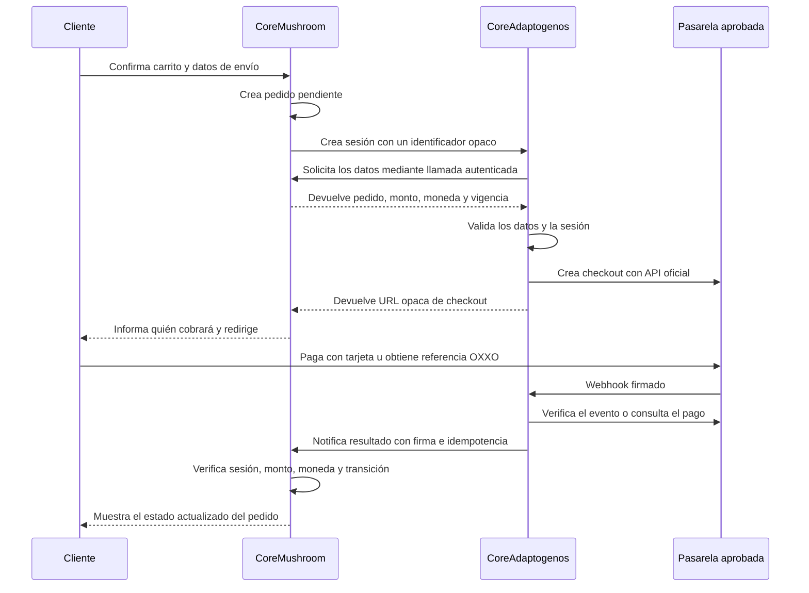

# Metodología de pagos entre CoreMushroom y CoreAdaptogenos

Estado: decisión arquitectónica aprobada; integración de tarjeta y OXXO aún no
implementada.

## Propósito

CoreMushroom es el escaparate, catálogo y origen de los pedidos. Conserva el
pedido completo en WooCommerce y procesa directamente la transferencia SPEI
manual con comprobante.

CoreAdaptogenos es la razón social cobradora. Cuando se habiliten tarjeta u
OXXO, el cliente saldrá de CoreMushroom hacia un checkout identificado de
CoreAdaptogenos únicamente para realizar el pago. El procesador debe conocer el
dominio de origen, el catálogo real y la relación entre ambas marcas.

La separación sirve para centralizar el cobro bajo la razón social. Nunca se
usa para ocultar productos, cambiar el giro declarado ni presentar al
procesador una operación distinta de la real.

## Flujo acordado

El regreso del navegador no confirma un pago. Los parámetros de una URL los
puede modificar el cliente. La única confirmación válida llega por webhook
firmado, se contrasta con la API de la pasarela cuando corresponda y después se
notifica de servidor a servidor a CoreMushroom.

## Responsabilidad de cada sistema

### CoreMushroom

- Crea el pedido y calcula el total definitivo, impuestos y envío.
- Guarda una sesión de pago opaca vinculada al pedido.
- Muestra antes de redirigir: razón social cobradora, monto, moneda, medio de
  pago y descriptor esperado.
- Nunca envía ni recibe números de tarjeta.
- Solo cambia un pedido a pagado tras validar la notificación de
  CoreAdaptogenos.
- Conserva SPEI manual y su comprobante en el flujo actual.

### CoreAdaptogenos

- Recibe solicitudes autenticadas exclusivamente desde CoreMushroom.
- Recupera y valida el monto del lado del servidor; nunca confía en un monto de
  la URL o del navegador.
- Crea el checkout con la API o el plugin oficial de la pasarela aprobada.
- Verifica la firma del webhook y el estado real del cargo.
- Notifica a CoreMushroom de forma firmada e idempotente.
- Ejecuta cancelaciones y reembolsos en la misma pasarela que cobró.

### Pasarela

- Conoce a CoreAdaptogenos como razón social cobradora.
- Conoce CoreMushroom, su catálogo y el dominio que originan los pedidos.
- Aloja o tokeniza los datos de tarjeta. Ninguno de los dos WordPress almacena
  datos sensibles de tarjeta.

## Contrato mínimo de una sesión

La URL solo contiene un identificador aleatorio de al menos 128 bits. Los datos
reales se intercambian por HTTPS entre servidores.

| Campo | Regla |
|---|---|
| `session_id` | Aleatorio, de un solo uso y sin datos del cliente |
| `origin_order_id` | Referencia interna; no autoriza por sí sola |
| `amount_minor` | Entero en centavos, calculado por CoreMushroom |
| `currency` | `MXN` y comparación exacta en ambos extremos |
| `method` | `card` u `oxxo`, dentro de una lista cerrada |
| `expires_at` | Vigencia corta; propuesta inicial de 15 minutos |
| `idempotency_key` | Impide crear o aplicar dos veces el mismo cobro |
| `return_url` | Lista permitida; nunca aceptada desde un parámetro libre |

Las solicitudes entre ambos sitios llevan marca de tiempo, nonce y firma HMAC,
o un mecanismo equivalente ofrecido por la infraestructura elegida. Las claves
se guardan en variables de entorno o `wp-config.php`, nunca en Git.

## Estados y reglas de transición

| Resultado | Estado del pedido en CoreMushroom |
|---|---|
| Sesión creada | Pendiente de pago |
| Tarjeta aprobada y verificada | Procesando |
| Tarjeta rechazada o sesión vencida | Pendiente de pago o fallido |
| Referencia OXXO emitida | En espera |
| OXXO pagado y verificado | Procesando |
| OXXO vencido | Cancelado según la política vigente |
| Reembolso confirmado | Reembolsado |

Una transición repetida debe producir el mismo resultado sin duplicar notas,
inventario, correos ni reembolsos. Un monto, moneda, sesión o pedido que no
coincida se rechaza y queda en el registro de auditoría.

## Controles obligatorios

- TLS válido en ambos dominios.
- Firma y antigüedad máxima en cada solicitud de servidor a servidor.
- Nonce de un solo uso y protección contra repetición.
- Comparación exacta de pedido, importe, moneda y entorno de pruebas o
  producción.
- Firma de webhook verificada según la documentación oficial del procesador.
- Consulta a la API del procesador antes de aceptar un estado dudoso.
- Lista permitida para URLs de retorno y redirección.
- Secretos fuera del repositorio público y rotación documentada.
- Registros sin números de tarjeta, comprobantes ni datos personales
  innecesarios.
- Reconciliación diaria de pedidos pagados contra cargos del procesador.
- Pruebas de pago aprobado, rechazado, pendiente, vencido, webhook repetido,
  monto alterado, firma inválida y caída temporal de cualquiera de los sitios.

## Experiencia del cliente

Antes del botón final se mostrará una leyenda equivalente a:

> Serás redirigido al portal seguro de CoreAdaptogenos, razón social encargada
> del cobro. Tu pedido permanecerá registrado en CoreMushroom.

El descriptor bancario y el correo de confirmación deben usar el mismo nombre
informado. Al volver, la pantalla podrá decir que el pago está en verificación;
nunca mostrará “pagado” basándose únicamente en la redirección.

## Datos pendientes antes de implementar

1. Dominio y URL final del checkout de CoreAdaptogenos.
2. Plataforma y versión de WordPress/WooCommerce, si aplica.
3. Pasarela aprobada y métodos habilitados en su contrato.
4. Descriptor que verá el tarjetahabiente.
5. Credenciales de pruebas y llave pública para verificar webhooks.
6. Política final de expiración para referencias OXXO.
7. Responsable operativo de conciliaciones y reembolsos.

Hasta tener esos datos y completar pruebas en sandbox, la opción de tarjeta de
CoreMushroom permanece oculta. No se escribirá una pasarela que capture tarjeta
directamente en este tema.
